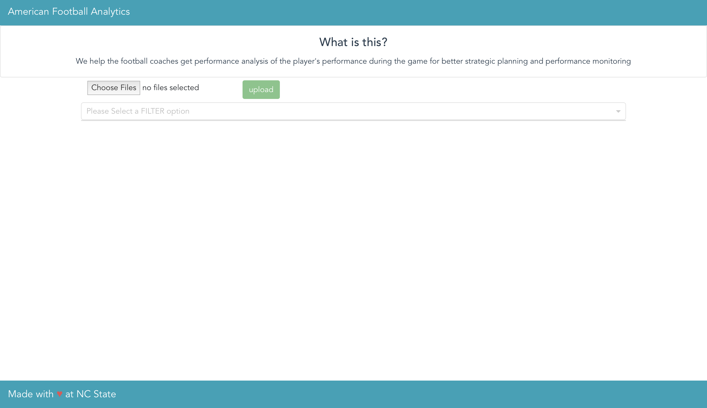
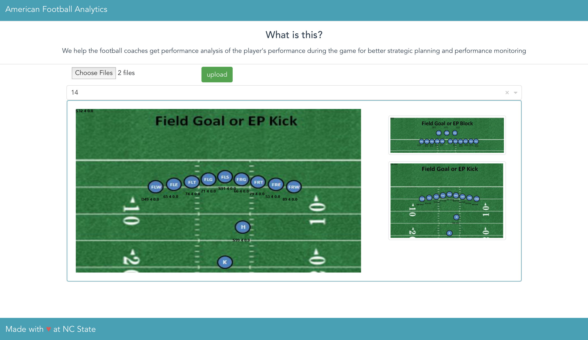
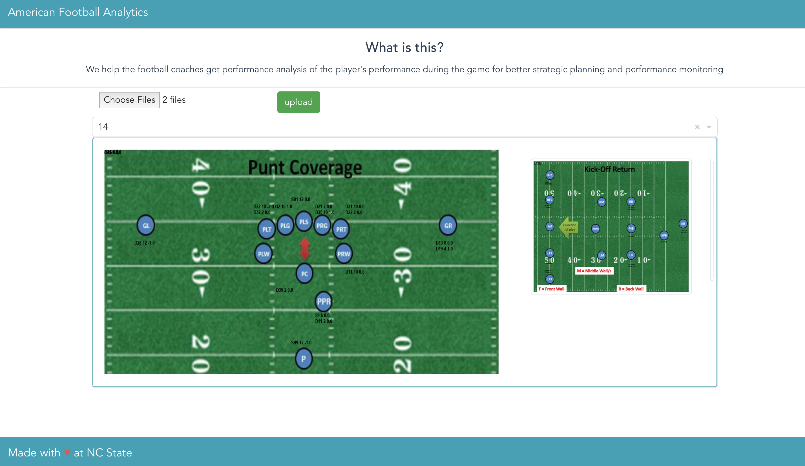

[](https://zenodo.org/badge/latestdoi/299747834)
[](https://opensource.org/licenses/MIT)
[](https://travis-ci.org/jayeshjakkani/American-Football-Analytics-Application)
[](https://github.com/himol7/American-Football-Analytics-Application/issues)
[](http://hits.dwyl.com/himol7/https://githubcom/himol7/American-Football-Analytics-Application)

# TouchDown, an Analytics application for American Football

[](https://www.youtube.com/watch?v=5O6O2h10K-g)

### Project Idea:

Create a web application which can:
* Analyze the football match data
* Show the summary visuals of the analysis

### Why TouchDown?
In 2002, Oakland Atheltics, a seemingly medium-strength team achieved unusual success in their season even after departure of key players. Behind their success was sabermetrics, a field which thrives on quantitative analysis of sports data. Drawing motivation from this success story and understanding the problems which the current football coaches at NC State are facing, we have developed TouchDown - a customer-centric easy-to-use application which provides you a pictorial analysis of position specific player performances.

With a simple UI, all you need to do it just upload the data file<sup>1</sup> and the application promptly outputs the images where you can view your analysis. 
Now with the new functionality features. Please check it out!!!

To use the application, all the user needs to do is to upload the data file on provided tab.


Here is a sample of outputs generated by uploading one of the games data file in out application.As part of **Project 2**, we have enhanced the front end with more features where one can add multiple input files to analyse the data and we have given option to select filter for the user to get specific data based on SEASON / MATCH WEEK / MONTH / MATCH and OPPONENT. 


Here as you can see, Player **S99** was present **2** times on position **H** and his overall score is **0.0**
This particular image in a analysis data for filter **WEEK** and filter value **WEEK 14**


Here as you can see, Player **D28** was present **6** times on position **GL** and his overall score is **-0.5**

As a part of **Project 1**, a functioning application was built which performs data analytics on games data and outputs 6 individual images for each type of play. Each of these images have summarized data of respective plays imposed on them.
As a part of **Project 2**, we have added a functionalities to get output of multiple files at once, filtering based on SEASON / MATCH WEEK / MONTH / MATCH and OPPONENT, Drag-and-Drop functionality in the Front End.

### Description of each class and function:
playseperator: takes the information regarding the team, datafiles, filter type and value and returns the dictonary with various positions.
photoimposer: imposes the ratings of the players on the images.
photocoordinates: defines the coordinates where the ratings needs to be present on the photos.
datacollector: used to read the csv files.
dataanalytics: this class takes formations and ratings as inputs and returns ratings of different players.

backend source application: app.py
afaarunner.py: integrates all the classes and gives the output for the ratings of players on images.

### Use case of AFAA
NC State has an upcoming football match with UNC. We have a data set of NCSU players and their previous matches. 
Now AFAA analyzes this data and suggest the best combination of players for the game. 

### Tasks to be completed as a part Project 3:

Things to be tested:
1. Functional behavior of the Application
2. Filtering functionality
3. Analysis of multiple files at once using the Drag-and-Drop feature

### Technology Stack
* Python Flask
* Vue.JS


### Instructions to run:
1. Git clone the repository and install the dependency for backend application.
```
git clone https://github.com/jayeshjakkani/American-Football-Analytics-Application.git
pip install -r requirements.txt
```
2. Please go to vue-app directory for running the front end.
* Make sure that npm is installed in the system
```
npm install npm -g  
```
* Install Vue cli
```
npm install -g @vue/cli OR yarn global add @vue/cli
```
* Run Vue UI
```
vue ui
 
```
For detailed steps visit[here](https://www.telerik.com/blogs/creating-and-managing-vue-projects-with-vue-ui)
3. Please go to backend/src directory for running the back end.

<sup>1</sup> Data file refers to the files which are used by football coaches at NC State. The original source of the files is not known to us but it is believed that the source is widely popular amongst football coaches.
